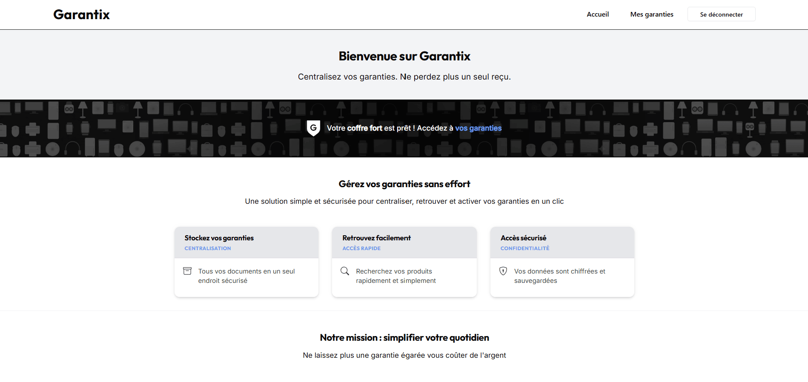

# Garantix 

Application web de gestion de garanties permettant aux utilisateurs de centraliser, suivre et gérer les garanties de leurs produits.

<!-- !Wiki -->
<!-- ![Aperçu de Garantix]screenshot.png) -->


**Les objectifs du projet :**

Au-delà de la gestion de garanties, ce projet a été l'occasion de mettre en pratique :

- le développement backend avec Django (authentification custom, CRUD, formulaires, vues génériques)
- la mise en place d'une intégration continue (CI) avec GitHub Actions (tests automatisés à chaque push/PR avec des règles définies)
- la conteneurisation de l'application avec Docker
- le déploiement sur un serveur OVH avec nom de domaine et DNS géré par Cloudflare
- la documentation du projet via un Wiki (choix techniques, guides d'installation)

**Aperçu :**




## Sommaire

- [Fonctionnalités](#fonctionnalités)
- [Stack technique](#stack-technique)
- [Installation](#installation)
- [Utilisation avec Docker](#utilisation-avec-docker)
- [Tests](#tests)
- [CI/CD](#cicd)
- [Déploiement](#déploiement)
- [Licence](#licence)


## Fonctionnalités

- Création de compte et authentification par email
- Ajout, modification, suppression et suivi des garanties produits
- Interface responsive avec design system Shoelace

<!-- Complétez avec les fonctionnalités spécifiques à Garantix : notifications d'expiration, upload de facture, export PDF, etc. -->


## Stack technique

| Domaine | Techno |
|---|---|
| Backend | Django 5.2, Python 3.11 |
| Base de données | PostgreSQL 17 |
| Frontend | Templates Django, Shoelace (Web Components) |
| Fichiers statiques | WhiteNoise |
| Conteneurisation | Docker, Docker Compose |
| CI/CD | GitHub Actions, déploiement automatisé |
| Hébergement | OVH, Cloudflare |


## Installation

### Prérequis

- Python 3.11
- PostgreSQL 17 (si exécution sans Docker)
- Docker & Docker Compose (recommandé)

### 1. Cloner le dépôt

```bash
git clone https://github.com/Melissa-code/Garantix.git garantix
cd garantix
```

### 2. Créer et activer l'environnement virtuel

```bash
# Windows
python -m venv env
env\Scripts\activate

# macOS / Linux
python -m venv env
source env/bin/activate
```

### 3. Installer les dépendances

```bash
pip install -r requirements.txt
```

### 4. Configurer les variables d'environnement

Créer un fichier `.env` à la racine (voir `.env.example` si disponible) avec au minimum :

```
SECRET_KEY=
DEBUG=True
DJANGO_ENV=development
DB_ENGINE=django.db.backends.postgresql
DB_NAME=
DB_USER=
DB_PASSWORD=
DB_HOST=localhost
DB_PORT=5432
```

### 5. Appliquer les migrations et lancer le serveur

```bash
cd src
python manage.py migrate
python manage.py runserver
```

Le site est accessible sur `http://127.0.0.1:8000`.


## Utilisation avec Docker

```bash
# Build de l'image
docker-compose build --no-cache

# Lancer les conteneurs
docker-compose up -d

# Migrations
docker-compose exec web python manage.py makemigrations
docker-compose exec web python manage.py migrate

# Collecte des fichiers statiques (automatique en prod, manuel si besoin en local)
docker exec -it garantix_web python manage.py collectstatic --noinput
```

### Ajouter une dépendance dans le conteneur

```bash
docker exec -it garantix_web pip install <package>
docker exec -it garantix_web pip freeze > requirements.txt
docker-compose build web
```

---

## Tests

Le projet inclut une suite de tests unitaires (modèles, urls, vues) exécutée automatiquement par la CI à chaque push et pull request.

```bash
# Avec Docker
docker-compose exec web python manage.py test

# Cibler une app précise
docker-compose exec web python manage.py test warranty.tests.test_models

# En local (depuis src/)
cd src
python manage.py test
```

Génération de données de test via [`factory-boy`](https://factoryboy.readthedocs.io/).


## Déploiement

Le site est hébergé sur OVH avec une plateforme de déploiement auto-hébergée gérant le build et la mise en production automatique.

- Les fichiers statiques sont servis par la librairie Python **WhiteNoise** (pas de second serveur Nginx séparé)
- `collectstatic` est exécuté automatiquement au démarrage du conteneur en production (voir `entrypoint.sh`), aucune commande manuelle n'est nécessaire après déploiement
- Le déploiement se déclenche automatiquement à chaque push sur `main`

---

## Licence

Ce projet est un projet personnel réalisé à des fins d'apprentissage. Tous droits réservés - le code est visible publiquement mais son utilisation, reproduction ou distribution sans autorisation n'est pas permise.
